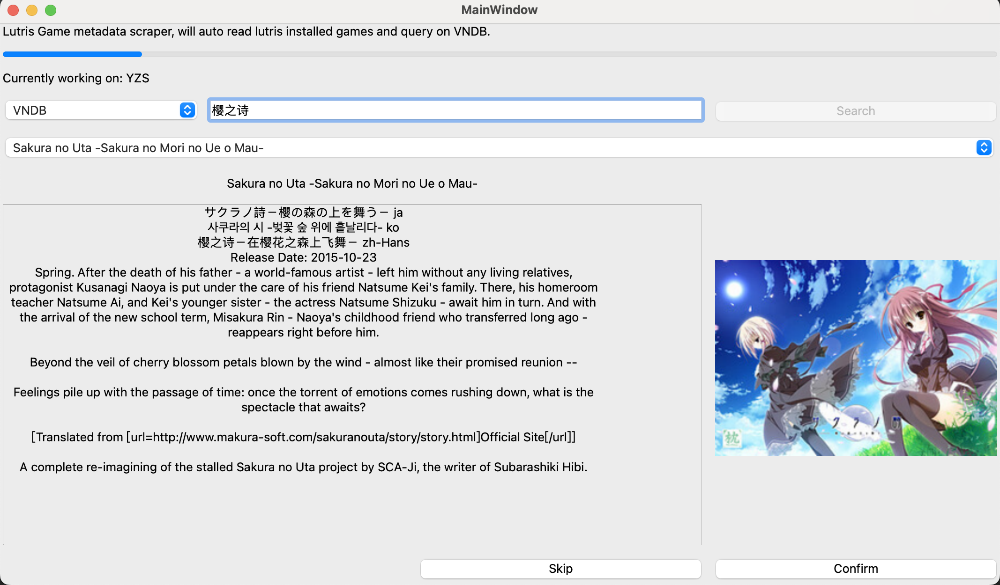
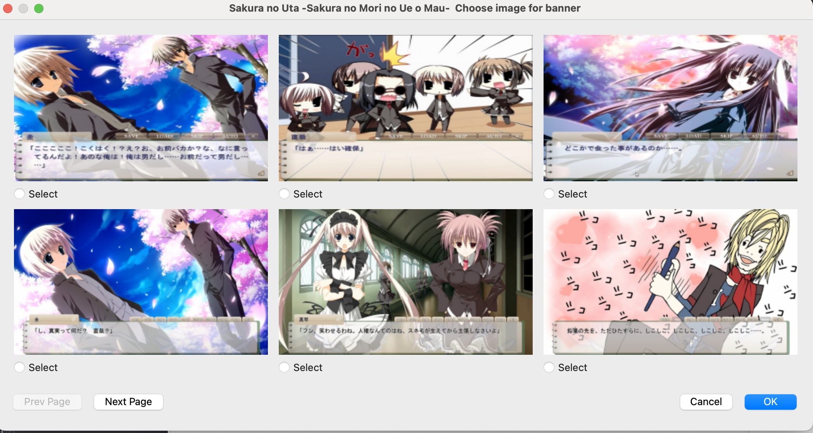

# Lutris Metadata/Cover image scraper

This is a lutris cover and banner image scraper which gets data from VNDB/DLSite and has a GUI to use.

Tested on **Steam Deck** and works perfectly. 

Can help add Visual Novel covers to Lutris.

Also when adding it as a Non-Steam game, the cover will also be applied.


## Usage
The latest version is in [Releases](https://github.com/ljm625/lutris_metadata_scraper/releases)

Please download and unzip it, then change config.yaml settings and open GUI to update cover/banner images.

The software will auto read Lutris game database and start the work.

**Currently the software won't detect if your game already have cover/banner, if so please skip the game manually, or it will be replaced!**


## Config
```yaml
update_title: true  # This decides whether the game title will be updated to VNDB/DLSite's title in Lutris
prefer_title_language: ["zh-Hans","ja","en"] # This is the prefered title language for VNDB, in this example if one game has for example zh-Hans title, it will always first use it, if not then ja and en
dlsite_lang: zh_CN # This is the dlsite search language, possible options are ja_JP / en_US, make sure to use the correct language to search when using DLsite
#lutris_db_path: ./pga.db # This is only for local debug/testing, don't uncomment it
```
## Screenshot



## Support

Feel free to open issue if you encounter any unexpected behavior.

